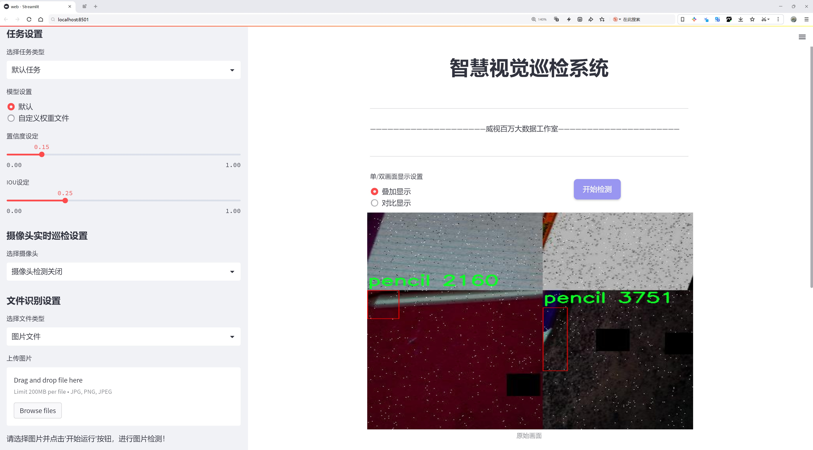
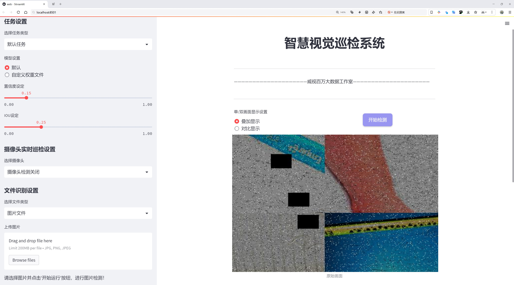
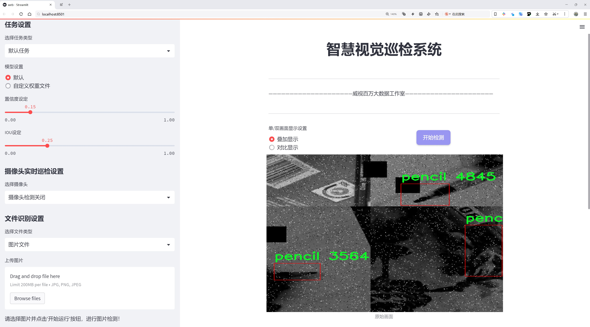
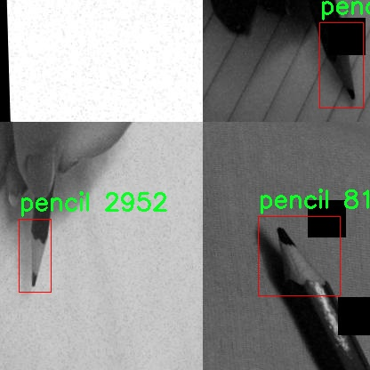
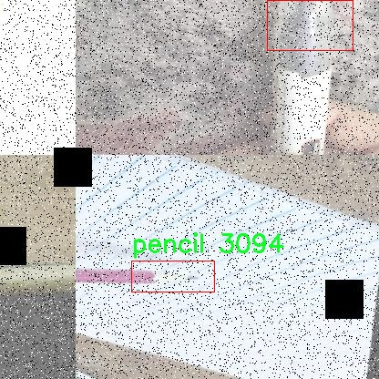
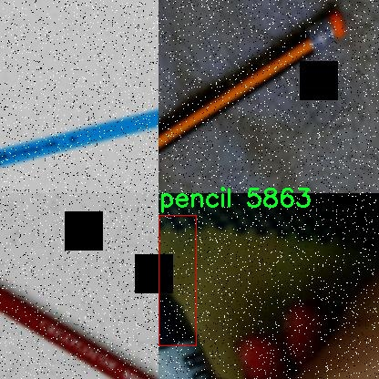
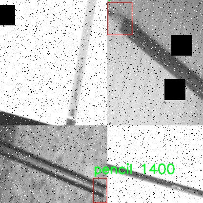
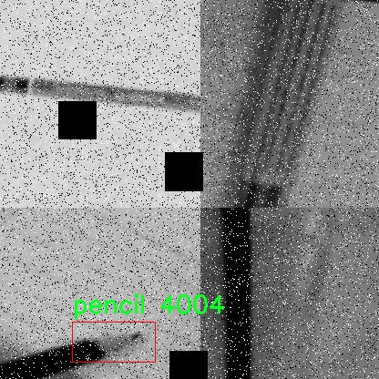

# 文具特征检测检测系统源码分享
 # [一条龙教学YOLOV8标注好的数据集一键训练_70+全套改进创新点发刊_Web前端展示]

### 1.研究背景与意义

项目参考[AAAI Association for the Advancement of Artificial Intelligence](https://gitee.com/qunshansj/projects)

项目来源[AACV Association for the Advancement of Computer Vision](https://gitee.com/qunmasj/projects)

研究背景与意义

随着科技的迅猛发展，计算机视觉技术在各个领域的应用日益广泛，尤其是在物体检测和识别方面。文具作为日常生活和学习中不可或缺的工具，其种类繁多，功能各异。传统的文具管理方式往往依赖人工识别和分类，效率低下且容易出错。因此，基于计算机视觉的文具特征检测系统的研究具有重要的现实意义。

在众多物体检测算法中，YOLO（You Only Look Once）系列算法因其高效性和实时性而备受关注。YOLOv8作为该系列的最新版本，进一步提升了检测精度和速度，适用于多种复杂场景。然而，针对特定文具物品的检测任务，YOLOv8仍然面临一些挑战，如在特征提取和分类精度方面的不足。为此，改进YOLOv8以适应文具特征检测的需求，成为了本研究的核心目标。

本研究所使用的数据集包含4500张图像，涵盖了两类文具：马克笔和铅笔。这一数据集的构建不仅为模型的训练提供了丰富的样本，也为后续的测试和验证奠定了基础。通过对这两类文具的特征进行深入分析，我们可以识别出其在形状、颜色、纹理等方面的独特性，从而为改进YOLOv8提供有力的支持。通过对数据集的标注和预处理，我们将能够提高模型的训练效率和检测准确率，确保其在实际应用中的可靠性。

此外，文具特征检测系统的研究不仅具有学术价值，也具备广泛的应用前景。在教育领域，教师和学生可以利用该系统快速识别和分类文具，提高学习和教学的效率。在文具生产和销售行业，企业可以借助该系统实现自动化管理，降低人工成本，提高运营效率。随着市场对智能化产品需求的增加，基于改进YOLOv8的文具特征检测系统将为相关行业带来新的机遇。

综上所述，基于改进YOLOv8的文具特征检测系统的研究，不仅填补了文具物体检测领域的空白，也为相关技术的进步提供了新的思路。通过深入探讨文具特征的提取与识别，推动计算机视觉技术在实际应用中的落地，具有重要的学术价值和社会意义。未来，随着数据集的不断丰富和算法的持续优化，该系统有望在更广泛的场景中发挥作用，为文具管理和智能化发展贡献力量。

### 2.图片演示







##### 注意：由于此博客编辑较早，上面“2.图片演示”和“3.视频演示”展示的系统图片或者视频可能为老版本，新版本在老版本的基础上升级如下：（实际效果以升级的新版本为准）

  （1）适配了YOLOV8的“目标检测”模型和“实例分割”模型，通过加载相应的权重（.pt）文件即可自适应加载模型。

  （2）支持“图片识别”、“视频识别”、“摄像头实时识别”三种识别模式。

  （3）支持“图片识别”、“视频识别”、“摄像头实时识别”三种识别结果保存导出，解决手动导出（容易卡顿出现爆内存）存在的问题，识别完自动保存结果并导出到tempDir中。

  （4）支持Web前端系统中的标题、背景图等自定义修改，后面提供修改教程。

  另外本项目提供训练的数据集和训练教程,暂不提供权重文件（best.pt）,需要您按照教程进行训练后实现图片演示和Web前端界面演示的效果。

### 3.视频演示

[3.1 视频演示](https://www.bilibili.com/video/BV1Jf4JeJEyb/)

### 4.数据集信息展示

##### 4.1 本项目数据集详细数据（类别数＆类别名）

nc: 1
names: ['pencil']


##### 4.2 本项目数据集信息介绍

数据集信息展示

在本研究中，我们使用了名为“capstone project”的数据集，旨在改进YOLOv8的文具特征检测系统。该数据集专注于特定类别的物品识别，主要涵盖了文具中的一种常见物品——铅笔。通过精心收集和标注的数据，研究团队希望提升模型在铅笔检测方面的准确性和效率，从而为文具识别的自动化提供强有力的支持。

“capstone project”数据集的类别数量为1，具体类别为“pencil”。这一单一类别的设计使得数据集在特定任务上的表现更加突出，便于模型聚焦于铅笔的特征提取与识别。数据集中的图像样本经过精心挑选，涵盖了不同品牌、颜色、形状和尺寸的铅笔，以确保模型能够学习到丰富的特征。这种多样性不仅提高了模型的泛化能力，还能有效应对实际应用中可能遇到的各种铅笔类型。

在数据集的构建过程中，研究团队采用了多种数据采集和增强技术，以增加样本的多样性和数量。通过拍摄不同光照条件、背景环境以及角度下的铅笔图像，数据集确保了模型在各种实际场景中的适应性。此外，数据增强技术如旋转、缩放、裁剪和颜色变换等被广泛应用，以进一步丰富训练数据。这些措施的实施，使得“capstone project”数据集不仅具备了高质量的标注信息，还拥有了良好的样本多样性，为后续的模型训练打下了坚实的基础。

在模型训练阶段，YOLOv8作为一种先进的目标检测算法，其高效的特征提取能力和快速的推理速度，使其成为处理“capstone project”数据集的理想选择。通过使用该数据集进行训练，YOLOv8能够学习到铅笔的独特特征，包括其形状、颜色和纹理等，从而在检测过程中实现高准确率和低误报率。研究团队在训练过程中不断调整模型参数，优化网络结构，以确保模型能够充分利用数据集中的信息，达到最佳的检测效果。

为了评估模型的性能，研究团队还设计了一系列实验，使用标准的评估指标如精确率、召回率和F1-score等，对模型在“capstone project”数据集上的表现进行全面分析。这些评估结果不仅反映了模型在铅笔检测任务中的有效性，也为后续的改进和优化提供了数据支持。

综上所述，“capstone project”数据集为本研究提供了一个专注于铅笔检测的高质量数据源。通过对该数据集的深入分析和利用，研究团队期望能够推动文具特征检测系统的进步，提升其在实际应用中的表现和可靠性。随着技术的不断发展和数据集的持续完善，未来的研究将有望在更广泛的文具识别领域取得突破，为教育、办公等多个行业带来便利。











### 5.全套项目环境部署视频教程（零基础手把手教学）

[5.1 环境部署教程链接（零基础手把手教学）](https://www.ixigua.com/7404473917358506534?logTag=c807d0cbc21c0ef59de5)


[5.2 安装Python虚拟环境创建和依赖库安装视频教程链接（零基础手把手教学）](https://www.ixigua.com/7404474678003106304?logTag=1f1041108cd1f708b01a)

### 6.手把手YOLOV8训练视频教程（零基础小白有手就能学会）

[6.1 手把手YOLOV8训练视频教程（零基础小白有手就能学会）](https://www.ixigua.com/7404477157818401292?logTag=d31a2dfd1983c9668658)

### 7.70+种全套YOLOV8创新点代码加载调参视频教程（一键加载写好的改进模型的配置文件）

[7.1 70+种全套YOLOV8创新点代码加载调参视频教程（一键加载写好的改进模型的配置文件）](https://www.ixigua.com/7404478314661806627?logTag=29066f8288e3f4eea3a4)

### 8.70+种全套YOLOV8创新点原理讲解（非科班也可以轻松写刊发刊，V10版本正在科研待更新）

由于篇幅限制，每个创新点的具体原理讲解就不一一展开，具体见下列网址中的创新点对应子项目的技术原理博客网址【Blog】：


[8.1 70+种全套YOLOV8创新点原理讲解链接](https://gitee.com/qunmasj/good)

### 9.系统功能展示（检测对象为举例，实际内容以本项目数据集为准）

图9.1.系统支持检测结果表格显示

  图9.2.系统支持置信度和IOU阈值手动调节

  图9.3.系统支持自定义加载权重文件best.pt(需要你通过步骤5中训练获得)

  图9.4.系统支持摄像头实时识别

  图9.5.系统支持图片识别

  图9.6.系统支持视频识别

  图9.7.系统支持识别结果文件自动保存

  图9.8.系统支持Excel导出检测结果数据


### 10.原始YOLOV8算法原理

原始YOLOv8算法原理

YOLOv8是Ultralytics于2023年1月发布的一款目标检测模型，代表了YOLO系列算法的又一次重要进化。该算法在设计上吸收了YOLOX、YOLOv6、YOLOv7和PPYOLOE等前辈算法的优点，尤其在Head标签分配和Loss计算部分与PP-YOLOE极为相似。通过这种集成，YOLOv8不仅实现了高精度和快速检测，还在实时检测领域达到了新的高度，展现出强大的视觉识别能力和广泛的应用潜力。

YOLOv8的网络结构主要由输入端、主干网络和检测端三部分组成。与之前的YOLO版本相比，YOLOv8在模型设计上进行了重要的创新和优化，尤其是在轻量化和性能提升方面。该模型提供了五种不同尺度的版本：n、s、m、l和x，分别对应不同的模型深度和特征图宽度。YOLOv8n作为最小版本，虽然在规模上较小，但依然保持了出色的检测性能。为了实现这一点，YOLOv8在改变缩放系数的同时，调整了主干网络的通道数，以确保模型的性能达到最优。

在YOLOv8的网络架构中，主干网络采用了PAN-FPN结构，然而与以往不同的是，YOLOv8在上采样部分删除了卷积结构。这一变化使得网络在保持轻量化的同时，能够更有效地传递特征信息。此外，YOLOv8引入了新的C2f模块，取代了之前的C3模块。C2f模块结合了YOLOv7中的ELAN模块思想，增加了更多的残差连接，从而在轻量化的基础上获得了更丰富的梯度信息。这种设计使得YOLOv8在特征提取和信息传递方面更加高效，能够更好地适应复杂的目标检测任务。

在检测头部分，YOLOv8采用了流行的解耦合头结构，将分类和检测任务分开处理。这一策略不仅提高了模型的灵活性，还使得YOLOv8能够更好地应对不同类型的目标检测问题。此外，YOLOv8还摒弃了传统的Anchor-Based方法，转而采用Anchor-Free的检测策略，这一创新进一步简化了模型的设计，提高了检测速度和准确性。

在训练过程中，YOLOv8在数据增强方面也进行了优化，特别是在最后10个epoch中关闭了马赛克增强，并采用了动态Task-Aligned Assigner样本分配策略。这一策略使得模型在训练过程中能够更有效地利用样本，提高了模型的泛化能力和鲁棒性。

在损失计算方面，YOLOv8使用了BCELoss作为分类损失，DFLLoss和CIoULoss作为回归损失。这种多损失函数的设计，使得模型在训练过程中能够更好地平衡分类和回归任务，提高了整体的检测性能。

轻量化的YOLOv8n目标检测模型在骨干特征提取网络层使用了更轻量化的C2F模块，替代了原来的C3模块，并将卷积核大小调整为3×3，深度设置为3、6、6、3。这一系列的调整使得YOLOv8n在保证检测性能的同时，显著降低了计算复杂度和内存占用。特征融合层则通过减少降采样层和引入BiFPN网络，进一步提高了对不同尺度特征信息的提取速度和效率。

BiFPN网络的设计理念是高效的双向跨尺度连接与加权特征融合。通过删除单输入对应的节点，并在同一层的输入输出节点之间添加连接，BiFPN网络能够有效地融合来自不同尺度的特征信息，从而提升模型的整体性能。这一创新使得YOLOv8在处理复杂场景时，能够更好地捕捉到目标的多样性和复杂性。

综上所述，YOLOv8在原始YOLO系列算法的基础上，通过一系列创新和优化，成功实现了高效、准确的目标检测。这一算法不仅在理论上具有重要的学术价值，也在实际应用中展现出广泛的潜力，尤其是在农业领域的苹果采摘等任务中，YOLOv8的视觉识别能力将为自动化作业提供强有力的支持。通过结合蚁群算法进行路径规划，YOLOv8的应用前景将更加广阔，为目标检测技术的发展带来新的冲击。


### 11.项目核心源码讲解（再也不用担心看不懂代码逻辑）

#### 11.1 code\ultralytics\models\yolo\classify\predict.py

以下是经过简化和注释的核心代码部分，保留了最重要的功能和逻辑：

```python
# 导入必要的库
import cv2
import torch
from PIL import Image
from ultralytics.engine.predictor import BasePredictor
from ultralytics.engine.results import Results
from ultralytics.utils import DEFAULT_CFG, ops

class ClassificationPredictor(BasePredictor):
    """
    基于分类模型的预测类，继承自BasePredictor类。
    可以使用Torchvision分类模型，例如：model='resnet18'。
    """

    def __init__(self, cfg=DEFAULT_CFG, overrides=None, _callbacks=None):
        """初始化ClassificationPredictor，将任务设置为'分类'。"""
        super().__init__(cfg, overrides, _callbacks)  # 调用父类构造函数
        self.args.task = "classify"  # 设置任务类型为分类
        self._legacy_transform_name = "ultralytics.yolo.data.augment.ToTensor"  # 旧版转换名称

    def preprocess(self, img):
        """将输入图像转换为模型兼容的数据类型。"""
        # 检查输入是否为torch.Tensor类型
        if not isinstance(img, torch.Tensor):
            # 检查是否使用了旧版转换
            is_legacy_transform = any(
                self._legacy_transform_name in str(transform) for transform in self.transforms.transforms
            )
            if is_legacy_transform:  # 处理旧版转换
                img = torch.stack([self.transforms(im) for im in img], dim=0)
            else:
                # 将图像从BGR格式转换为RGB格式并应用转换
                img = torch.stack(
                    [self.transforms(Image.fromarray(cv2.cvtColor(im, cv2.COLOR_BGR2RGB))) for im in img], dim=0
                )
        # 将图像转换为适合模型的类型并移动到模型设备上
        img = (img if isinstance(img, torch.Tensor) else torch.from_numpy(img)).to(self.model.device)
        # 根据模型的fp16设置将图像转换为半精度或单精度浮点数
        return img.half() if self.model.fp16 else img.float()  # uint8转换为fp16/32

    def postprocess(self, preds, img, orig_imgs):
        """对预测结果进行后处理，返回Results对象。"""
        # 如果输入图像不是列表，则将其转换为numpy数组
        if not isinstance(orig_imgs, list):  
            orig_imgs = ops.convert_torch2numpy_batch(orig_imgs)

        results = []  # 存储结果的列表
        for i, pred in enumerate(preds):
            orig_img = orig_imgs[i]  # 获取原始图像
            img_path = self.batch[0][i]  # 获取图像路径
            # 将结果存储为Results对象
            results.append(Results(orig_img, path=img_path, names=self.model.names, probs=pred))
        return results  # 返回处理后的结果
```

### 代码分析：
1. **导入模块**：引入了处理图像和模型的必要库。
2. **ClassificationPredictor类**：继承自`BasePredictor`，用于处理分类任务。
3. **初始化方法**：设置任务类型为分类，并处理旧版转换名称。
4. **预处理方法**：将输入图像转换为模型所需的格式，包括处理不同类型的输入（如Tensor或numpy数组）。
5. **后处理方法**：将模型的预测结果转换为`Results`对象，便于后续使用和分析。

以上代码展示了如何构建一个用于图像分类的预测器，包含了输入预处理和输出后处理的核心逻辑。

这个文件是Ultralytics YOLO（You Only Look Once）项目中的一个分类预测模块，主要用于图像分类任务。文件中定义了一个名为`ClassificationPredictor`的类，它继承自`BasePredictor`类，专门用于基于分类模型进行预测。

在类的初始化方法`__init__`中，首先调用了父类的初始化方法，并将任务类型设置为“classify”，这表明该预测器的主要功能是进行分类。此外，定义了一个名为`_legacy_transform_name`的属性，用于处理旧版的图像转换。

`preprocess`方法负责对输入图像进行预处理，以便将其转换为模型所需的数据类型。该方法首先检查输入图像是否为PyTorch张量。如果不是，它会检查是否使用了旧版的图像转换方法。如果是，则将输入图像堆叠成一个张量；如果不是，则将图像转换为RGB格式后再进行堆叠。最后，方法将图像转换为模型所需的浮点格式，并根据模型的设置选择使用半精度（fp16）或单精度（fp32）。

`postprocess`方法用于对模型的预测结果进行后处理，以返回`Results`对象。该方法首先检查原始图像是否为列表，如果不是，则将其转换为NumPy数组。接着，方法遍历每个预测结果，将原始图像、图像路径、模型名称和预测概率封装到`Results`对象中，并将其添加到结果列表中。

总的来说，这个文件实现了一个分类预测器，能够处理输入图像，进行分类预测，并返回结构化的结果，便于后续分析和使用。

#### 11.2 ui.py

```python
import sys
import subprocess

def run_script(script_path):
    """
    使用当前 Python 环境运行指定的脚本。

    Args:
        script_path (str): 要运行的脚本路径

    Returns:
        None
    """
    # 获取当前 Python 解释器的路径
    python_path = sys.executable

    # 构建运行命令，使用 streamlit 运行指定的脚本
    command = f'"{python_path}" -m streamlit run "{script_path}"'

    # 执行命令并等待其完成
    result = subprocess.run(command, shell=True)
    
    # 检查命令执行的返回码，如果不为0则表示出错
    if result.returncode != 0:
        print("脚本运行出错。")


# 实例化并运行应用
if __name__ == "__main__":
    # 指定要运行的脚本路径
    script_path = "web.py"  # 这里可以直接指定脚本名

    # 调用函数运行脚本
    run_script(script_path)
```

### 代码注释说明：
1. **导入模块**：
   - `sys`：用于获取当前 Python 解释器的路径。
   - `subprocess`：用于执行外部命令。

2. **`run_script` 函数**：
   - 功能：在当前 Python 环境中运行指定的脚本。
   - 参数：`script_path`，要运行的脚本的路径。
   - 过程：
     - 获取当前 Python 解释器的路径，以便后续调用。
     - 构建命令字符串，使用 `streamlit` 模块运行指定的脚本。
     - 使用 `subprocess.run` 执行命令，并等待其完成。
     - 检查命令的返回码，如果返回码不为0，表示脚本运行出错，打印错误信息。

3. **主程序部分**：
   - 使用 `if __name__ == "__main__":` 确保只有在直接运行该脚本时才会执行以下代码。
   - 指定要运行的脚本路径（这里直接使用脚本名 `web.py`）。
   - 调用 `run_script` 函数，传入脚本路径以执行。

这个程序文件名为 `ui.py`，主要功能是通过当前的 Python 环境运行一个指定的脚本。首先，程序导入了必要的模块，包括 `sys`、`os` 和 `subprocess`，以及一个自定义的路径处理模块 `abs_path`。

在 `run_script` 函数中，首先获取当前 Python 解释器的路径，这通过 `sys.executable` 实现。接着，构建一个命令字符串，用于运行指定的脚本。这里使用了 `streamlit` 模块来运行脚本，命令格式为 `python -m streamlit run "script_path"`。

然后，使用 `subprocess.run` 方法执行这个命令，`shell=True` 允许在 shell 中执行命令。执行后，程序检查返回码，如果返回码不为 0，表示脚本运行出错，程序会输出相应的错误信息。

在文件的最后部分，使用 `if __name__ == "__main__":` 语句来确保只有在直接运行该文件时才会执行下面的代码。这里指定了要运行的脚本路径为 `web.py`，并调用 `run_script` 函数来执行这个脚本。

总体来说，这个程序的目的是方便地通过 Python 环境运行一个 Streamlit 应用脚本，并在出现错误时提供反馈。

#### 11.3 70+种YOLOv8算法改进源码大全和调试加载训练教程（非必要）\ultralytics\models\rtdetr\train.py

以下是经过简化和注释的核心代码部分：

```python
# 导入必要的库
from copy import copy
import torch
from ultralytics.models.yolo.detect import DetectionTrainer
from ultralytics.nn.tasks import RTDETRDetectionModel
from ultralytics.utils import RANK, colorstr
from .val import RTDETRDataset, RTDETRValidator

class RTDETRTrainer(DetectionTrainer):
    """
    RT-DETR模型的训练类，继承自YOLO的DetectionTrainer类。
    该模型由百度开发，旨在实现实时目标检测，利用视觉变换器（Vision Transformers）和其他特性。
    """

    def get_model(self, cfg=None, weights=None, verbose=True):
        """
        初始化并返回一个用于目标检测的RT-DETR模型。

        参数:
            cfg (dict, optional): 模型配置，默认为None。
            weights (str, optional): 预训练模型权重的路径，默认为None。
            verbose (bool): 是否启用详细日志，默认为True。

        返回:
            (RTDETRDetectionModel): 初始化后的模型。
        """
        # 创建RT-DETR检测模型
        model = RTDETRDetectionModel(cfg, nc=self.data['nc'], verbose=verbose and RANK == -1)
        # 如果提供了权重，则加载权重
        if weights:
            model.load(weights)
        return model

    def build_dataset(self, img_path, mode='val', batch=None):
        """
        构建并返回用于训练或验证的RT-DETR数据集。

        参数:
            img_path (str): 包含图像的文件夹路径。
            mode (str): 数据集模式，'train'或'val'。
            batch (int, optional): 矩形训练的批大小，默认为None。

        返回:
            (RTDETRDataset): 针对特定模式的数据集对象。
        """
        # 创建RT-DETR数据集
        return RTDETRDataset(img_path=img_path,
                             imgsz=self.args.imgsz,
                             batch_size=batch,
                             augment=mode == 'train',  # 训练模式下进行数据增强
                             hyp=self.args,
                             rect=False,
                             cache=self.args.cache or None,
                             prefix=colorstr(f'{mode}: '),  # 添加模式前缀
                             data=self.data)

    def get_validator(self):
        """
        返回适合RT-DETR模型验证的检测验证器。

        返回:
            (RTDETRValidator): 用于模型验证的验证器对象。
        """
        self.loss_names = 'giou_loss', 'cls_loss', 'l1_loss'  # 定义损失名称
        return RTDETRValidator(self.test_loader, save_dir=self.save_dir, args=copy(self.args))

    def preprocess_batch(self, batch):
        """
        预处理一批图像，将图像缩放并转换为浮点格式。

        参数:
            batch (dict): 包含一批图像、边界框和标签的字典。

        返回:
            (dict): 预处理后的批次数据。
        """
        # 调用父类的预处理方法
        batch = super().preprocess_batch(batch)
        bs = len(batch['img'])  # 批次大小
        batch_idx = batch['batch_idx']  # 批次索引
        gt_bbox, gt_class = [], []  # 初始化真实边界框和类别列表
        
        # 遍历每个样本，提取真实边界框和类别
        for i in range(bs):
            gt_bbox.append(batch['bboxes'][batch_idx == i].to(batch_idx.device))  # 获取当前样本的边界框
            gt_class.append(batch['cls'][batch_idx == i].to(device=batch_idx.device, dtype=torch.long))  # 获取当前样本的类别
        return batch  # 返回预处理后的批次数据
```

### 代码注释说明：
1. **类和方法的功能**：每个方法的功能、参数和返回值都进行了详细注释，帮助理解其用途。
2. **逻辑流程**：通过注释解释了每个步骤的逻辑，例如如何创建模型、构建数据集、获取验证器和预处理批次数据。
3. **关键变量的解释**：对重要变量和操作进行了说明，确保读者能够理解代码的具体实现。

这个程序文件是用于训练RT-DETR模型的Python代码，RT-DETR是百度开发的一种实时目标检测模型，基于YOLO框架进行扩展。代码中包含了模型的初始化、数据集构建、验证器的获取以及批处理的预处理等功能。

首先，程序导入了必要的库，包括`torch`和一些来自`ultralytics`的模块，这些模块提供了YOLO的检测训练器、RT-DETR模型、数据集和验证器等功能。接着，定义了一个名为`RTDETRTrainer`的类，该类继承自`DetectionTrainer`，用于适应RT-DETR模型的特性和架构。

在类的文档字符串中，说明了RT-DETR模型的一些特点，比如使用了视觉变换器（Vision Transformers）和具有IoU感知查询选择的能力。此外，还提到了一些注意事项，例如`F.grid_sample`在RT-DETR中不支持`deterministic=True`参数，以及AMP训练可能导致NaN输出和在二分图匹配过程中出现错误。

`RTDETRTrainer`类中定义了多个方法。`get_model`方法用于初始化并返回一个RT-DETR模型，接受模型配置、预训练权重路径和详细日志的参数。若提供了权重路径，则会加载相应的权重。

`build_dataset`方法用于构建并返回一个RT-DETR数据集，接受图像路径、模式（训练或验证）和批量大小作为参数。该方法会根据模式设置数据增强，并返回一个数据集对象。

`get_validator`方法返回一个适用于RT-DETR模型验证的验证器对象，同时设置损失名称，包括giou损失、分类损失和l1损失。

最后，`preprocess_batch`方法用于对一批图像进行预处理，主要是缩放和转换图像格式。该方法会从父类中调用`preprocess_batch`，然后提取出每个图像的边界框和类别，并将其转换为适当的设备和数据类型。

整体来看，这段代码为RT-DETR模型的训练提供了必要的框架和功能，便于用户进行目标检测任务的训练和验证。

#### 11.4 train.py

以下是经过简化和注释的核心代码部分：

```python
import random
import numpy as np
import torch.nn as nn
from ultralytics.data import build_dataloader, build_yolo_dataset
from ultralytics.engine.trainer import BaseTrainer
from ultralytics.models import yolo
from ultralytics.nn.tasks import DetectionModel
from ultralytics.utils import LOGGER, RANK
from ultralytics.utils.torch_utils import de_parallel, torch_distributed_zero_first

class DetectionTrainer(BaseTrainer):
    """
    基于检测模型的训练类，继承自BaseTrainer类。
    """

    def build_dataset(self, img_path, mode="train", batch=None):
        """
        构建YOLO数据集。

        参数:
            img_path (str): 图像文件夹的路径。
            mode (str): 模式，可以是'train'或'val'，用于不同的数据增强。
            batch (int, optional): 批次大小，仅在'rect'模式下使用。
        """
        gs = max(int(de_parallel(self.model).stride.max() if self.model else 0), 32)  # 获取模型的最大步幅
        return build_yolo_dataset(self.args, img_path, batch, self.data, mode=mode, rect=mode == "val", stride=gs)

    def get_dataloader(self, dataset_path, batch_size=16, rank=0, mode="train"):
        """构建并返回数据加载器。"""
        assert mode in ["train", "val"]  # 确保模式有效
        with torch_distributed_zero_first(rank):  # 在分布式训练中，仅初始化一次数据集
            dataset = self.build_dataset(dataset_path, mode, batch_size)
        shuffle = mode == "train"  # 训练模式下打乱数据
        workers = self.args.workers if mode == "train" else self.args.workers * 2  # 设置工作线程数
        return build_dataloader(dataset, batch_size, workers, shuffle, rank)  # 返回数据加载器

    def preprocess_batch(self, batch):
        """对图像批次进行预处理，包括缩放和转换为浮点数。"""
        batch["img"] = batch["img"].to(self.device, non_blocking=True).float() / 255  # 转换为浮点数并归一化
        if self.args.multi_scale:  # 如果启用多尺度
            imgs = batch["img"]
            sz = (
                random.randrange(self.args.imgsz * 0.5, self.args.imgsz * 1.5 + self.stride)
                // self.stride
                * self.stride
            )  # 随机选择图像大小
            sf = sz / max(imgs.shape[2:])  # 计算缩放因子
            if sf != 1:
                ns = [
                    math.ceil(x * sf / self.stride) * self.stride for x in imgs.shape[2:]
                ]  # 计算新的图像形状
                imgs = nn.functional.interpolate(imgs, size=ns, mode="bilinear", align_corners=False)  # 进行插值
            batch["img"] = imgs
        return batch

    def get_model(self, cfg=None, weights=None, verbose=True):
        """返回YOLO检测模型。"""
        model = DetectionModel(cfg, nc=self.data["nc"], verbose=verbose and RANK == -1)  # 创建检测模型
        if weights:
            model.load(weights)  # 加载权重
        return model

    def plot_training_samples(self, batch, ni):
        """绘制训练样本及其标注。"""
        plot_images(
            images=batch["img"],
            batch_idx=batch["batch_idx"],
            cls=batch["cls"].squeeze(-1),
            bboxes=batch["bboxes"],
            paths=batch["im_file"],
            fname=self.save_dir / f"train_batch{ni}.jpg",
            on_plot=self.on_plot,
        )

    def plot_metrics(self):
        """从CSV文件中绘制指标。"""
        plot_results(file=self.csv, on_plot=self.on_plot)  # 保存结果图
```

### 代码注释说明：
1. **类定义**：`DetectionTrainer` 类用于处理YOLO模型的训练过程，继承自 `BaseTrainer`。
2. **构建数据集**：`build_dataset` 方法用于创建YOLO数据集，支持训练和验证模式。
3. **获取数据加载器**：`get_dataloader` 方法构建数据加载器，确保在分布式训练中只初始化一次数据集。
4. **预处理批次**：`preprocess_batch` 方法对输入图像进行归一化和缩放处理，支持多尺度训练。
5. **获取模型**：`get_model` 方法用于创建YOLO检测模型，并可选择性地加载预训练权重。
6. **绘制训练样本**：`plot_training_samples` 方法用于可视化训练样本及其标注信息。
7. **绘制指标**：`plot_metrics` 方法用于从CSV文件中提取并绘制训练过程中的指标。

以上是对核心代码的简化和详细注释，便于理解YOLO模型的训练过程。

这个程序文件 `train.py` 是一个用于训练 YOLO（You Only Look Once）目标检测模型的实现，继承自 `BaseTrainer` 类。它包含了多个方法，主要用于构建数据集、获取数据加载器、预处理图像、设置模型属性、获取模型、进行验证、记录损失、输出训练进度、绘制训练样本和绘制训练指标等。

首先，`DetectionTrainer` 类的构造函数会接收一些参数，这些参数用于指定模型的配置、数据集路径和训练的轮数等。通过调用 `train()` 方法，可以开始训练过程。

在 `build_dataset` 方法中，程序会根据给定的图像路径和模式（训练或验证）构建 YOLO 数据集。该方法会根据模型的步幅（stride）计算出合适的大小，并调用 `build_yolo_dataset` 函数来实际构建数据集。

`get_dataloader` 方法则负责创建数据加载器。它会检查模式是否为训练或验证，并在分布式训练时确保数据集只初始化一次。该方法还会处理数据加载时的打乱顺序，并根据模式调整工作线程的数量。

在 `preprocess_batch` 方法中，程序会对输入的图像批次进行预处理，包括将图像缩放到合适的大小并转换为浮点数。若启用了多尺度训练，图像的大小会在一定范围内随机选择，并进行插值处理，以适应模型的输入要求。

`set_model_attributes` 方法用于设置模型的属性，包括类别数量和类别名称等。这些信息会被附加到模型中，以便后续的训练和验证。

`get_model` 方法返回一个 YOLO 检测模型实例，并可选择加载预训练权重。`get_validator` 方法则返回一个用于验证模型性能的验证器。

在训练过程中，`label_loss_items` 方法会返回一个包含训练损失项的字典，便于记录和分析训练过程中的损失情况。`progress_string` 方法会生成一个格式化的字符串，显示当前训练进度，包括当前轮次、GPU 内存使用情况、损失值、实例数量和图像大小等信息。

此外，`plot_training_samples` 方法会绘制训练样本及其标注，以便可视化训练数据的质量。`plot_metrics` 和 `plot_training_labels` 方法则用于绘制训练过程中的指标和标签，帮助用户更好地理解模型的训练效果。

总体而言，这个文件提供了一个完整的训练框架，涵盖了从数据准备到模型训练和评估的各个环节，便于用户进行目标检测模型的训练和调试。

#### 11.5 code\ultralytics\models\fastsam\predict.py

以下是代码中最核心的部分，并附上详细的中文注释：

```python
import torch
from ultralytics.engine.results import Results
from ultralytics.models.fastsam.utils import bbox_iou
from ultralytics.models.yolo.detect.predict import DetectionPredictor
from ultralytics.utils import ops

class FastSAMPredictor(DetectionPredictor):
    """
    FastSAMPredictor类专门用于在Ultralytics YOLO框架中进行快速SAM（Segment Anything Model）分割预测任务。
    该类继承自DetectionPredictor，定制了预测管道，特别针对快速SAM进行了调整。
    """

    def __init__(self, cfg=DEFAULT_CFG, overrides=None, _callbacks=None):
        """
        初始化FastSAMPredictor类，设置任务为'分割'。
        
        Args:
            cfg (dict): 预测的配置参数。
            overrides (dict, optional): 可选的参数覆盖，用于自定义行为。
            _callbacks (dict, optional): 可选的回调函数列表，在预测过程中调用。
        """
        super().__init__(cfg, overrides, _callbacks)
        self.args.task = "segment"  # 设置任务为分割

    def postprocess(self, preds, img, orig_imgs):
        """
        对预测结果进行后处理，包括非极大值抑制和将框缩放到原始图像大小，并返回最终结果。
        
        Args:
            preds (list): 模型的原始输出预测。
            img (torch.Tensor): 处理后的图像张量。
            orig_imgs (list | torch.Tensor): 原始图像或图像列表。
        
        Returns:
            (list): 包含处理后的框、掩码和其他元数据的Results对象列表。
        """
        # 执行非极大值抑制，过滤掉低置信度的预测框
        p = ops.non_max_suppression(
            preds[0],
            self.args.conf,
            self.args.iou,
            agnostic=self.args.agnostic_nms,
            max_det=self.args.max_det,
            nc=1,  # SAM没有类别预测，因此设置为1类
            classes=self.args.classes,
        )
        
        # 创建一个全框，包含图像的宽高和其他信息
        full_box = torch.zeros(p[0].shape[1], device=p[0].device)
        full_box[2], full_box[3], full_box[4], full_box[6:] = img.shape[3], img.shape[2], 1.0, 1.0
        full_box = full_box.view(1, -1)
        
        # 计算与全框的IoU，并根据阈值筛选
        critical_iou_index = bbox_iou(full_box[0][:4], p[0][:, :4], iou_thres=0.9, image_shape=img.shape[2:])
        if critical_iou_index.numel() != 0:
            full_box[0][4] = p[0][critical_iou_index][:, 4]
            full_box[0][6:] = p[0][critical_iou_index][:, 6:]
            p[0][critical_iou_index] = full_box  # 更新预测框

        # 如果输入图像是张量而不是列表，则转换格式
        if not isinstance(orig_imgs, list):
            orig_imgs = ops.convert_torch2numpy_batch(orig_imgs)

        results = []  # 存储最终结果
        proto = preds[1][-1] if len(preds[1]) == 3 else preds[1]  # 获取掩码预测的原型

        # 遍历每个预测结果
        for i, pred in enumerate(p):
            orig_img = orig_imgs[i]  # 获取原始图像
            img_path = self.batch[0][i]  # 获取图像路径
            
            if not len(pred):  # 如果没有预测框
                masks = None
            elif self.args.retina_masks:  # 如果使用Retina掩码
                pred[:, :4] = ops.scale_boxes(img.shape[2:], pred[:, :4], orig_img.shape)  # 缩放框
                masks = ops.process_mask_native(proto[i], pred[:, 6:], pred[:, :4], orig_img.shape[:2])  # 处理掩码
            else:  # 否则使用普通掩码处理
                masks = ops.process_mask(proto[i], pred[:, 6:], pred[:, :4], img.shape[2:], upsample=True)  # 处理掩码
                pred[:, :4] = ops.scale_boxes(img.shape[2:], pred[:, :4], orig_img.shape)  # 缩放框
            
            # 将结果存储到Results对象中
            results.append(Results(orig_img, path=img_path, names=self.model.names, boxes=pred[:, :6], masks=masks))
        
        return results  # 返回处理后的结果列表
```

### 代码说明：
1. **类定义**：`FastSAMPredictor`类继承自`DetectionPredictor`，用于快速的分割任务。
2. **初始化方法**：在初始化时设置任务为分割，并调用父类的初始化方法。
3. **后处理方法**：`postprocess`方法对模型的原始预测结果进行后处理，包括非极大值抑制、框的缩放和掩码的处理，最终返回一个包含结果的列表。

这个程序文件是一个用于快速分割任务的预测器，名为 `FastSAMPredictor`，它是基于 Ultralytics YOLO 框架的。该类继承自 `DetectionPredictor`，并专门针对快速 SAM（Segment Anything Model）分割预测任务进行了定制。它的主要功能是调整预测管道，以便进行单类分割的掩码预测和非极大值抑制（NMS），从而优化分割效果。

在类的初始化方法中，`FastSAMPredictor` 接收配置参数、可选的参数覆盖和回调函数。它调用父类的初始化方法，并将任务类型设置为“分割”。

`postprocess` 方法是该类的核心，负责对模型的原始输出进行后处理。具体步骤包括应用非极大值抑制以过滤掉重叠的框，并将框的尺寸缩放回原始图像的大小。该方法接收三个参数：模型的原始预测结果、处理后的图像张量和原始图像。它首先通过调用 `ops.non_max_suppression` 函数对预测结果进行非极大值抑制，得到经过筛选的框。

接下来，程序构建了一个全框（`full_box`），并计算与原始图像的 IoU（Intersection over Union）。如果 IoU 大于设定的阈值，程序会更新全框的置信度和其他信息。然后，如果输入的原始图像不是列表格式，则将其转换为 NumPy 格式。

在处理每个预测结果时，程序会检查是否存在有效的预测。如果没有有效的框，掩码将设置为 `None`。如果启用了“视网膜掩码”选项，程序会使用 `ops.process_mask_native` 函数处理掩码；否则，它会使用 `ops.process_mask` 函数。最终，处理后的结果将被封装为 `Results` 对象，并返回一个包含所有结果的列表。

总体来说，这个文件实现了一个高效的分割预测器，专注于快速处理和优化分割任务，适用于 Ultralytics YOLO 框架。

#### 11.6 70+种YOLOv8算法改进源码大全和调试加载训练教程（非必要）\ultralytics\models\sam\modules\encoders.py

以下是经过简化和注释的核心代码部分，主要保留了 `ImageEncoderViT` 类及其相关的功能：

```python
import torch
import torch.nn as nn
from typing import Optional, Tuple, Type

class ImageEncoderViT(nn.Module):
    """
    使用视觉变换器（ViT）架构的图像编码器，将图像编码为紧凑的潜在空间。
    该编码器将图像分割为补丁，并通过一系列变换块处理这些补丁。
    编码后的补丁随后通过一个颈部模块生成最终的编码表示。
    """

    def __init__(
            self,
            img_size: int = 1024,  # 输入图像的尺寸，假设为正方形
            patch_size: int = 16,   # 补丁的尺寸
            in_chans: int = 3,      # 输入图像的通道数
            embed_dim: int = 768,   # 补丁嵌入的维度
            depth: int = 12,        # ViT的深度（变换块的数量）
            num_heads: int = 12,    # 每个ViT块中的注意力头数量
            out_chans: int = 256,    # 输出通道数
            norm_layer: Type[nn.Module] = nn.LayerNorm,  # 归一化层
    ) -> None:
        """
        初始化图像编码器的参数。
        """
        super().__init__()
        self.img_size = img_size

        # 初始化补丁嵌入模块
        self.patch_embed = PatchEmbed(
            kernel_size=(patch_size, patch_size),
            stride=(patch_size, patch_size),
            in_chans=in_chans,
            embed_dim=embed_dim,
        )

        # 初始化变换块
        self.blocks = nn.ModuleList()
        for _ in range(depth):
            block = Block(
                dim=embed_dim,
                num_heads=num_heads,
                norm_layer=norm_layer,
            )
            self.blocks.append(block)

        # 颈部模块，用于进一步处理输出
        self.neck = nn.Sequential(
            nn.Conv2d(embed_dim, out_chans, kernel_size=1, bias=False),
            nn.LayerNorm(out_chans),
            nn.Conv2d(out_chans, out_chans, kernel_size=3, padding=1, bias=False),
            nn.LayerNorm(out_chans),
        )

    def forward(self, x: torch.Tensor) -> torch.Tensor:
        """
        处理输入，通过补丁嵌入、变换块和颈部模块生成编码表示。
        """
        x = self.patch_embed(x)  # 将输入图像转换为补丁嵌入
        for blk in self.blocks:   # 通过每个变换块处理嵌入
            x = blk(x)
        return self.neck(x.permute(0, 3, 1, 2))  # 通过颈部模块生成最终输出


class PatchEmbed(nn.Module):
    """图像到补丁嵌入的转换模块。"""

    def __init__(
            self,
            kernel_size: Tuple[int, int] = (16, 16),
            stride: Tuple[int, int] = (16, 16),
            in_chans: int = 3,
            embed_dim: int = 768,
    ) -> None:
        """
        初始化补丁嵌入模块。
        """
        super().__init__()
        # 使用卷积层将图像转换为补丁嵌入
        self.proj = nn.Conv2d(in_chans, embed_dim, kernel_size=kernel_size, stride=stride)

    def forward(self, x: torch.Tensor) -> torch.Tensor:
        """计算补丁嵌入，通过卷积和转置结果张量。"""
        return self.proj(x).permute(0, 2, 3, 1)  # B C H W -> B H W C


class Block(nn.Module):
    """变换块，包含注意力机制和前馈网络。"""

    def __init__(
        self,
        dim: int,
        num_heads: int,
        norm_layer: Type[nn.Module] = nn.LayerNorm,
    ) -> None:
        """
        初始化变换块的参数。
        """
        super().__init__()
        self.norm1 = norm_layer(dim)  # 归一化层
        self.attn = Attention(dim, num_heads=num_heads)  # 注意力机制
        self.norm2 = norm_layer(dim)  # 第二个归一化层
        self.mlp = MLPBlock(embedding_dim=dim)  # 前馈网络

    def forward(self, x: torch.Tensor) -> torch.Tensor:
        """执行变换块的前向传播。"""
        shortcut = x
        x = self.norm1(x)  # 归一化
        x = self.attn(x)   # 注意力机制
        x = shortcut + x   # 残差连接
        return x + self.mlp(self.norm2(x))  # 通过前馈网络并返回


class Attention(nn.Module):
    """多头注意力机制。"""

    def __init__(
        self,
        dim: int,
        num_heads: int = 8,
    ) -> None:
        """
        初始化注意力模块。
        """
        super().__init__()
        self.num_heads = num_heads
        self.qkv = nn.Linear(dim, dim * 3)  # 查询、键、值的线性变换
        self.proj = nn.Linear(dim, dim)  # 输出的线性变换

    def forward(self, x: torch.Tensor) -> torch.Tensor:
        """执行注意力机制的前向传播。"""
        B, H, W, _ = x.shape
        qkv = self.qkv(x).reshape(B, H * W, 3, self.num_heads, -1).permute(2, 0, 3, 1, 4)
        q, k, v = qkv.reshape(3, B * self.num_heads, H * W, -1).unbind(0)

        attn = (q @ k.transpose(-2, -1))  # 计算注意力权重
        attn = attn.softmax(dim=-1)  # 应用softmax
        x = (attn @ v).view(B, self.num_heads, H, W, -1).permute(0, 2, 3, 1, 4).reshape(B, H, W, -1)
        return self.proj(x)  # 返回经过线性变换的输出
```

### 代码说明：
1. **ImageEncoderViT**: 这是一个图像编码器类，使用视觉变换器（ViT）架构来处理输入图像并生成编码表示。它包含补丁嵌入、变换块和颈部模块。
2. **PatchEmbed**: 这个类负责将输入图像分割成补丁并进行嵌入。
3. **Block**: 变换块类，包含注意力机制和前馈网络。
4. **Attention**: 多头注意力机制的实现，计算查询、键、值的线性变换并应用注意力权重。

这些核心部分共同构成了一个基本的视觉变换器模型，用于图像编码任务。

这个程序文件是一个实现YOLOv8算法中图像编码器和提示编码器的模块，主要用于将输入图像和提示信息（如点、框和掩码）编码为适合后续处理的特征表示。文件中定义了多个类，每个类都有其特定的功能和结构。

首先，`ImageEncoderViT`类是一个基于视觉变换器（ViT）架构的图像编码器。它的主要功能是将输入图像编码为一个紧凑的潜在空间表示。该类的构造函数接收多个参数，包括输入图像的大小、补丁大小、输入通道数、嵌入维度、深度、注意力头数等。构造函数中首先创建了一个补丁嵌入模块，然后根据深度参数构建多个变换器块，最后通过一个颈部模块进一步处理输出，生成最终的编码表示。在前向传播中，输入图像经过补丁嵌入、位置嵌入（如果存在）、多个变换器块的处理，最后通过颈部模块输出编码结果。

接下来，`PromptEncoder`类用于编码不同类型的提示信息，包括点、框和掩码。它生成稀疏和密集的嵌入表示。该类的构造函数接收嵌入维度、输入图像大小、掩码输入通道数等参数。它包含多个子模块，例如用于随机位置嵌入的`PositionEmbeddingRandom`模块，以及用于处理点和框的嵌入。`forward`方法接收点、框和掩码作为输入，并返回稀疏和密集的嵌入表示。

`PositionEmbeddingRandom`类实现了基于随机空间频率的位置信息编码。它的构造函数初始化了一个随机的高斯矩阵，用于生成位置编码。在前向传播中，该类根据输入的大小生成相应的位置信息编码。

`Block`类表示变换器块，支持窗口注意力和残差传播。它包含归一化层、注意力模块和多层感知机（MLP）模块。在前向传播中，输入首先经过归一化，然后通过注意力模块处理，最后与输入进行残差连接，并通过MLP进行进一步处理。

`Attention`类实现了多头注意力机制，支持相对位置嵌入。它的前向传播方法计算查询、键和值的注意力分数，并应用相对位置嵌入（如果启用）。

此外，文件中还定义了一些辅助函数，如`window_partition`和`window_unpartition`，用于将输入张量划分为非重叠窗口，以及从窗口中恢复原始序列。`get_rel_pos`和`add_decomposed_rel_pos`函数用于处理相对位置嵌入。

最后，`PatchEmbed`类负责将图像转换为补丁嵌入，通过卷积操作实现。它的前向传播方法计算补丁嵌入并调整张量的维度。

整体来看，这个文件实现了YOLOv8算法中图像和提示信息的编码模块，为后续的目标检测和分割任务提供了基础。

### 12.系统整体结构（节选）

### 整体功能和架构概括

该项目是一个基于YOLO（You Only Look Once）框架的目标检测和分割系统，主要用于实现高效的图像处理和模型训练。项目包含多个模块，涵盖了从数据准备、模型训练、预测到后处理的完整流程。以下是各个模块的主要功能：

- **数据处理**：包括数据集的构建、图像预处理和数据加载。
- **模型训练**：实现了不同模型（如YOLO、RT-DETR、FastSAM等）的训练过程，支持多种训练配置和参数设置。
- **预测和推理**：提供了针对不同任务（如分类、检测、分割）的预测器，能够对输入图像进行实时推理。
- **损失计算**：定义了用于训练过程中损失计算的模块。
- **工具和实用功能**：包括用于模型评估、可视化和分布式训练的工具。

### 文件功能整理表

| 文件路径                                                                                                         | 功能描述                                                       |
|------------------------------------------------------------------------------------------------------------------|--------------------------------------------------------------|
| `code\ultralytics\models\yolo\classify\predict.py`                                                              | 实现分类预测器，处理图像分类任务的输入和输出。                     |
| `ui.py`                                                                                                         | 提供一个简单的界面，通过Python环境运行指定的Streamlit脚本。        |
| `70+种YOLOv8算法改进源码大全和调试加载训练教程（非必要）\ultralytics\models\rtdetr\train.py`                   | 实现RT-DETR模型的训练，包括数据集构建、模型初始化和验证。          |
| `train.py`                                                                                                      | 提供YOLO模型的训练框架，涵盖数据集构建、损失记录和训练进度显示。    |
| `code\ultralytics\models\fastsam\predict.py`                                                                   | 实现FastSAM分割预测器，处理图像分割任务的输入和输出。              |
| `70+种YOLOv8算法改进源码大全和调试加载训练教程（非必要）\ultralytics\models\sam\modules\encoders.py`            | 实现图像编码器和提示编码器，将输入图像和提示信息编码为特征表示。   |
| `70+种YOLOv8算法改进源码大全和调试加载训练教程（非必要）\ultralytics\models\utils\loss.py`                    | 定义用于训练过程中的损失计算模块，支持多种损失函数。               |
| `code\ultralytics\utils\dist.py`                                                                                | 提供分布式训练的工具函数，支持多GPU训练和数据并行。                |
| `code\ultralytics\solutions\speed_estimation.py`                                                               | 实现速度估计的功能，可能用于实时检测和优化模型性能。               |
| `70+种YOLOv8算法改进源码大全和调试加载训练教程（非必要）\ultralytics\models\yolo\detect\predict.py`            | 实现YOLO目标检测的预测器，处理输入图像并返回检测结果。             |
| `70+种YOLOv8算法改进源码大全和调试加载训练教程（非必要）\ultralytics\nn\__init__.py`                         | 初始化神经网络模块，可能包含模型构建和层定义。                     |
| `70+种YOLOv8算法改进源码大全和调试加载训练教程（非必要）\ultralytics\trackers\track.py`                      | 实现目标跟踪功能，支持对检测到的目标进行追踪。                     |
| `code\ultralytics\data\annotator.py`                                                                           | 提供数据标注工具，可能用于可视化和编辑数据集中的标注信息。          |

这个表格总结了每个文件的主要功能，便于理解项目的整体结构和各个模块之间的关系。

注意：由于此博客编辑较早，上面“11.项目核心源码讲解（再也不用担心看不懂代码逻辑）”中部分代码可能会优化升级，仅供参考学习，完整“训练源码”、“Web前端界面”和“70+种创新点源码”以“13.完整训练+Web前端界面+70+种创新点源码、数据集获取”的内容为准。

### 13.完整训练+Web前端界面+70+种创新点源码、数据集获取


# [下载链接：https://mbd.pub/o/bread/ZpuUlphu](https://mbd.pub/o/bread/ZpuUlphu)